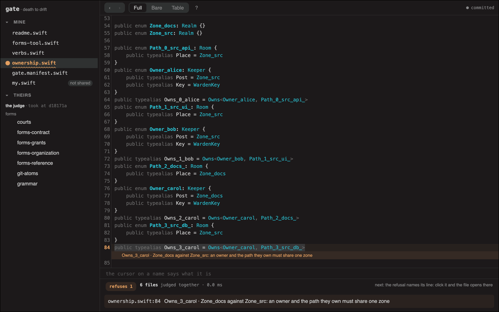

# gate · death to drift

Your repository is full of sentences that must match something, and nobody
checks the match. The schema must match the service that writes it. The
rota must match who actually answers. Each pair held the day you or a
colleague wrote it down, and nobody records the day the two stop
matching.

One case, to be concrete. CODEOWNERS hands `/src/api` to @alice. The folder
was renamed to `/services/api` in the spring. The rule now matches nothing,
reviews still go to Alice, and no tool reports a problem: there was no
event on either file to notice. You find out at
an audit, or the day a colleague merges what nobody reviewed.

That gap has a name: drift. Two records of one fact, coming apart in
silence, while both still get obeyed.

You know it by its local names: config drift, doc rot, schema drift, a
stale CODEOWNERS. The mechanism is one: two records, and nobody
compares them.

The usual cure is to pick one place and call it the source of truth. But a
source has a direction: everything downstream must watch it, and it watches
nothing. The folder was renamed in a pull request that never read the file.
A file everyone must keep current is a chore for everyone, so it is a chore
for nobody, and the chosen file goes stale like any other. gate starts from
the opposite fact: there is no source, so there is no direction. The team
that owns the folders declares them, once. The review rule declares the
folder it points at. Two declarations about one folder cannot differ in
silence. Either they are equal, or you get the exact point of contact:

```
$ gate status
status: refused 1
  ownership.swift:89 · Owns_3_carol · Zone_docs against Zone_src: an owner and
                       the path they own must share one zone
```

That is a CODEOWNERS rule, translated once, judged on every change: carol
keeps `docs`, and one line assigns her a folder in `src`. The refusal
names the file, the line, and both sides of the disagreement. A diff
compares two texts. This compares two claims about one thing.

The same refusal on the live page (`gate serve`), at its line. The picture
is a door, and so is this line: [the same bench, live in your
browser](https://danielswift1992.github.io/gate/?f=ownership.swift:89),
over the demo, judged as you type.

[](https://danielswift1992.github.io/gate/?f=ownership.swift:89)

The check is one lookup per claim and nothing else: no search, no solver,
no build. The cost is linear in the number of claims: milliseconds on a
real repository, and still milliseconds when the repository is ten times
the size. So it runs on every keystroke, in every commit,
and in CI, with nobody waiting on it. The sentence is measured:
docs/BENCH.md carries the numbers, and `python3 bin/bench.py` reprints
them on your machine.

No server. No runtime. No new formats. Nothing leaves your repository.

## try it on your own repository

```sh
git clone https://github.com/DanielSwift1992/gate && cd gate    # no install step
./gate import codeowners CODEOWNERS --tree . --policy owners.csv -o ownership.swift   # your own ownership, judged
./gate drift ../api/openapi.json --client ../sdk-js   # your contract, your client
./gate serve                                   # the same facts as a live page
```

Run the first two lines in repositories you already have. Ownership is a
fact you already keep, in a file that cannot say whether an
owner exists or whether a pattern still matches anything. The command
turns it into a judged world, and you write none of it: it writes one
small Swift file, `ownership.swift`, and no Swift toolchain is involved,
because the judge reads it directly. Drop the `-o` and it writes nothing
at all: the same reading, printed, and your repository left as it was.
`owners.csv` is two columns, and it
adds the one thing CODEOWNERS cannot express: which zone each owner
keeps.

`drift` reads an API contract and a client library out of git on your
machine, and prints what the copies have been doing to each other.
It uploads nothing and fetches nothing. It observes rather than
judges: the exit code follows a threshold you declare (`--fail-over 30`),
never a verdict of ours.

No repository of your own at hand? `gate demo` makes one: a small tree
with a CODEOWNERS whose one rule reaches outside its zone, so the first
thing you see is the refusal above. Everything it makes is committed the
moment it is made, and `git checkout .` is the whole way back.

Every command here is written `gate`. Until it is on your path it is
`./gate`, run from the clone: nothing else to install, nothing else to
undo.

## ask the file, not a person

The state of the art for these is a search: grep, a ticket, whoever
remembers. Here each is a lookup against the file, in milliseconds:

| The question | Today | Here |
|---|---|---|
| May this person read this document? | ask the owner, or read the ACLs by hand | `gate check view Emp0042 FinanceShare` |
| What breaks if we move them to Sales? | find out after the move | `gate diff transfer Emp0042 Sales` |
| Who may merge this, and since when? | convention, and memory | `gate guard merge` · `gate log` |
| Which commit broke this rule? | bisect by hand, if anyone notices | `git bisect run gate status` |
| Is anything inconsistent right now? | an audit, quarterly | `gate status`, on every keystroke |

The names come from a sandbox this repository makes for you; your own
commands use your own names. You pay once, per name you
translate. Every question after that is a composition of what you already
translated, and compositions are free: the opposite of a reporting tool,
where each new question is new work. The tool is general; the table is
one example. You point it at any pair: a Jira ticket and the TODO that
cites it, k8s RBAC and the cluster
it describes, an API contract and a client in another language.

## find your drift

Yours is wherever two places state one fact. Take a thing you shipped this
month and ask: where is this written down, and where else? Who checks the
two against each other, and when did anybody last do it? The pairs you
cannot answer for are your drift, and every team has them: the schema and
the service that writes it, the contract and the client, the rota and the
pager, the config nobody dares delete.

You are looking for pairs, not objects: one fact always has more than one
record. And the loudest marker is anything that calls itself the source of
truth: a self-declared source is the record nobody compares to the others
any more, so that is usually where drift collects.

Gate first the pairs that cross a boundary: two teams, two repositories,
two languages. A fact drifts where it changes hands.

The quick first look is one command, over the git history already in your
clone. `gate findings` prints plain sentences: who changed which facts,
across how many commits, and whether any hook or workflow checked those
edits. `gate findings --history` says when a pair parted and how much has
passed through since. It needs no setup and judges nothing yet: these
are readings, not verdicts.

Something drifts? Gate it

## gate it

To gate a pair: put your half of it in a file, once. From then on every
change is checked against it, and the other side sees it the next time
they check.

If your half is already a table (CODEOWNERS, a CSV), one command puts it
in, and your file stays in place: whatever read it keeps reading it. What
enters gate is a second record of the same fact, the kind of pair this
tool exists to hold. A CSV round-trips: `gate export` prints the tables
back, and the diff against the originals is empty. A CODEOWNERS is judged
against your tree as it lands: the refusal at the top of this page is
exactly that, a rule reaching outside its zone, and a pattern that
matches no file is named beside the verdict. And the two stay compared:
the world names its source on its own `from:` line, every `gate status`
translates the file again and holds the two together, and a line changed
on either side alone is named at its line. If your half is not a table,
you write it as a file yourself: a page of plain declarations, translated
by hand, once. The rules are small, and they are yours to read. That is
the upkeep, all of it.

The same move works between teams. You do not test my API, and I do not
mock yours. Each side states its half in its own repository, the seam is
judged, and a disagreement is named at its address on both sides. What
used to be an integration test is a verdict.

You already write claims: every line of CODEOWNERS is one. These nine
lines, from the demo's `ownership.swift`, are the same claim with its
parts named: the
zone, a path in it, an owner posted to it, and the tie between them:

```swift
public enum Zone_docs: Realm {}
public enum Path_2_docs_: Room {
    public typealias Place = Zone_docs
}
public enum Owner_carol: Keeper {
    public typealias Post = Zone_docs
    public typealias Key = WardenKey
}
public typealias Owns_2_carol = Owns<Owner_carol, Path_2_docs_>
```

The language is three things: names, claims between names, and the
rules the claims must satisfy. In the forms, a Realm is a zone, a Room
a place in it, a Keeper its owner. The judge asks one
question of every claim: the same, or not, and at which line.

The files are bare Swift: the same language with the ceremony stripped,
and no DSL. Records are declarations, rules are type constraints in the
same text, so a record that violates a rule does not get flagged: it fails
to exist. And because it is plain Swift, a second, independent reader
exists whenever you want one: `swiftc -typecheck` passes on these files as
they are, with no project and no build. Git keeps doing what it already
does best: history, authorship, review, rollback.

A domain's vocabulary is the forms a world of that kind is written in. It
is a unit of its own, and today forms arrive by two roads: shipped on the
shelf in `stdlib/` and judged with the rest of this repository, or
declared in a file of your own beside your world. The goal is one road, a
shelf where every form is presented and nothing is built in, and that is
a debt on this project, not a claim about it. `gate stdlib show
forms-organization` prints any shelf page exactly as it shipped.

The porcelain is deliberately git-shaped: `init · status/fsck · log ·
check · diff · apply · import/export · verify · guard · library · survey ·
drift · badge · mine · theirs · declare · seam · attention · serve ·
report · stdlib · my · demo · findings · --version`. A refusal exits
non-zero, so hooks and CI need no wrappers, and every command ends by
naming the one step that comes next, so the whole ladder stays out of
your head.

## what this does not touch

A drifted record is one problem: two spellings of one fact, and the
judge names the line where they part. What two people mean by a record
is another problem, and no check turns two readings into one. gate does
not try. Its one move is to put the agreement in writing before the
argument: each side states its half in its own file, the judge compares the
halves from then on, and you hold a meeting when the verdict says you
differ. If CODEOWNERS hands the payments folder to an intern,
the rule holds and every record agrees with it. Whether it should is a
claim you can state too: write it as policy, let the other side write
theirs, and the verdict says if you agree. Agreement here is not
assumed. It is stated twice, and confirmed.

## death to drift

Every pair you gate is one thing you stop keeping in your head. An
unwritten agreement has no address: to obey one, you remember them
all. A gated pair has an address: the judge brings the one line your
change touched, and the rest stay written. Today
you keep other people's facts by hand: you review renames because
a stale rule routes them to you, you spend audit week rebuilding
answers, and you remember what breaks when a path moves. Gate a pair
and you state your half once; the judge holds it from there. Agreement
is a verdict: a break is named at its line, on the breaker's screen,
the day it lands. A rename goes red for the renamer. A new hire's
access is one diff with an owner's name on it. Deleting an old config
takes an afternoon, because its readers are a list. The checking does
not pile up: a claim is one lookup, so a hundred pairs cost what ten
did. Your work did not get faster. The asking is gone.

## the rest, one page deep

The cover you just read is the product. The pieces below are one file
away, each where you would look for it:

- [docs/DETAILS.md](docs/DETAILS.md): carrying gate vendored in your
  repository, verifying the zero-egress contract yourself, where it plugs
  in (hook, CI, review, editor), layout and ownership, and the arithmetic
  of why a judged pair pays.
- [docs/SECURITY.md](docs/SECURITY.md): what a verdict promises, and where to
  report a wrong one.
- [docs/CHANGELOG.md](docs/CHANGELOG.md): what exists, in the order it came to be.
- After `gate init`, your repository is met by a letter of its own:
  `stdlib/readme.swift`, beside your files and judged with them.

## what you just cloned

```
LICENSE         MIT · docs/NOTICE.md lists the bundled pieces and their terms
gate            the CLI (python prototype; the judge does the judging)
gate.cmd        the same CLI on Windows
gate.manifest.swift
                this repository's own declared layout: its worlds, their
                roles, and the judge's row, judged like anybody's
CODEOWNERS · owners.csv
                who owns this repository, and the zone that owner keeps:
                the two files the first recipe above reads, kept here for
                the same reason yours are kept in yours
ownership.swift this repository's own ownership, printed from those two by
                the command CODEOWNERS itself names, and judged with the
                rest of the world
gate.policy.swift
                who keeps this repository, said once: the email git
                records bound to the keeper ownership.swift declares. A
                name the world does not declare is refused at this line
bin/gate-judge  the judge, one static binary, built at a pin from the
                public theory corpus, verification-is-identification:
                github.com/DanielSwift1992/verification-is-identification
                (bin/build-judge.sh [pin] rebuilds it)
bin/judge.js · bin/judge-cli.js · bin/judge-where.js
                both courts as a node port, for machines the binary
                was not built for, held to it line for line
bin/gate-cli.swift
                the Swift CLI, growing beside the python one verb by
                verb: it alone states what it carries, and a carried
                verb answers with the python side's own bytes
                (bin/build-cli.sh builds it; the binary is not committed)
stdlib/         the judge's own words, printed as real Swift files, self-judged
web/ui.html     the workbench; bin/judge.js judges it in the browser
web/codemirror.*  the editor (CodeMirror 5, MIT, vendored)
demo/           runnable worlds: CODEOWNERS + policy, CSV org, K8s RBAC
docs/           DETAILS.md, SECURITY.md, CHANGELOG.md, NOTICE.md, and
                the cover's picture with its provenance
tests/smoke.py   the battery: 474 checks this repository holds itself
                 to, end-to-end runs through judge parity through
                 documentation contracts; the definition of green
tests/windows.py the Windows measure: the reviewer's road as asserts
```

## what runs today, and what is next

```
$ gate badge
badge: 188 claims · holds
```

The badge is this repository's own, and the judge re-counts it on every
run.

Working prototype under active development, MIT licensed: see LICENSE,
and docs/NOTICE.md for the bundled pieces and their terms. The judge is a
native binary with a versioned verdict contract (canon v2). The CLI is
python and will be rewritten in Swift to ship as a single static binary
(the way git is one tool). We want to hear
about a wrong verdict before anything else: see docs/SECURITY.md.

**Where it runs.** The CLI is one python3
file and the bench is a page, so both go wherever python3 and a browser
go. The judge is a native binary built for one platform: `bin/gate-judge`
here is `Mach-O arm64`, and on any other machine it does not execute. On
such a machine node runs both courts instead: `bin/judge-cli.js` runs the
plain court, `bin/judge-where.js` runs the certificate court, both ported
line for line, and the battery holds the port to the binary's own lines.
`gate --version` says which court ran on your machine. On macOS, CI runs
the full battery on every push. On Windows, CI runs `tests/windows.py` on
every push: it makes the demo, takes the kit, breaks a claim, and the
break is refused at its line, all under the port. So Windows is measured on every push.
On Linux, CI rebuilds the judge at the same pin and runs the full
battery on every push, so every platform named here is measured.

Roadmap, next: single-binary Swift CLI (Linux/Windows included) · the
bare-Swift diff view (`gate diff` shows the stripped form, `--full` the
whole text) · editable bare view in the bench · apply routing over the
declared layout · more domain forms.

Something drifts? Gate it
